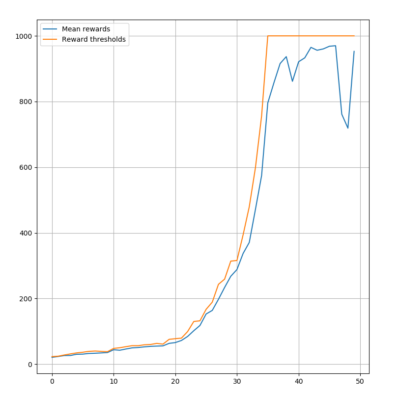

# Deep-Cross-Entropy-Method
# Deep Cross-Entropy Method

This project is the implementation of Deep Cross-Entropy Method. The CEM is an adaptive importance sampling method for the estimation of rare event probabilities. The general idea is to gradually change the sampling distribution of random search so that rare events are more likely to occur. The algorithm starts by generating observations using random search. Top k observations are sampled from these sets of observations and optimization is performed. This process continues till convergence. The Deep CEM is a deep learning version of CEM where instead of having a look-up table the neural network is responsible for choosing the best actions. The learning part of the network is done using backpropagation.

The model designed in this project is quite simple with just 2 hidden layers having 20 neurons each. To test this model &#39;Cart Pole&#39; environment from OpenAI gym was used. The results obtained are plotted as &quot;Rewards per Episode&quot; vs &quot;Number of episodes&quot;.

# Dependencies

sklearn == 0.22.1

torch == 1.4.0

gym == 0.15.6
